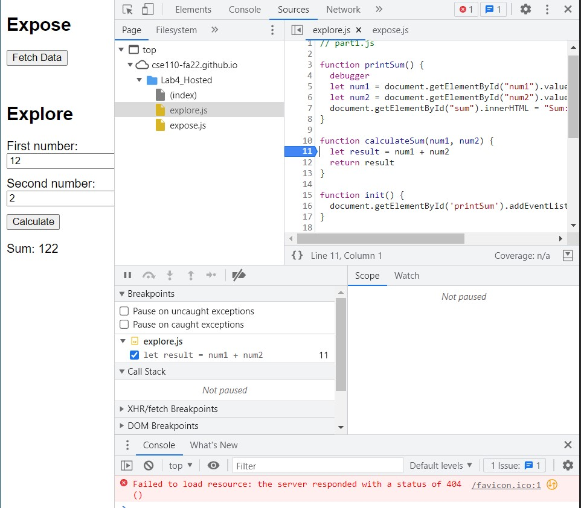
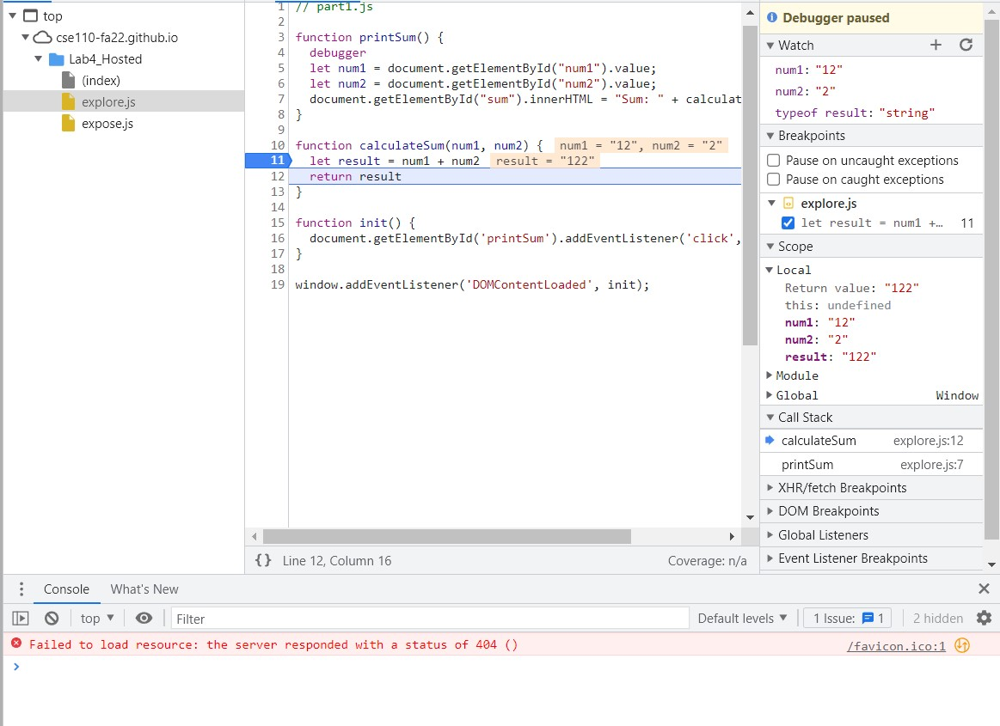
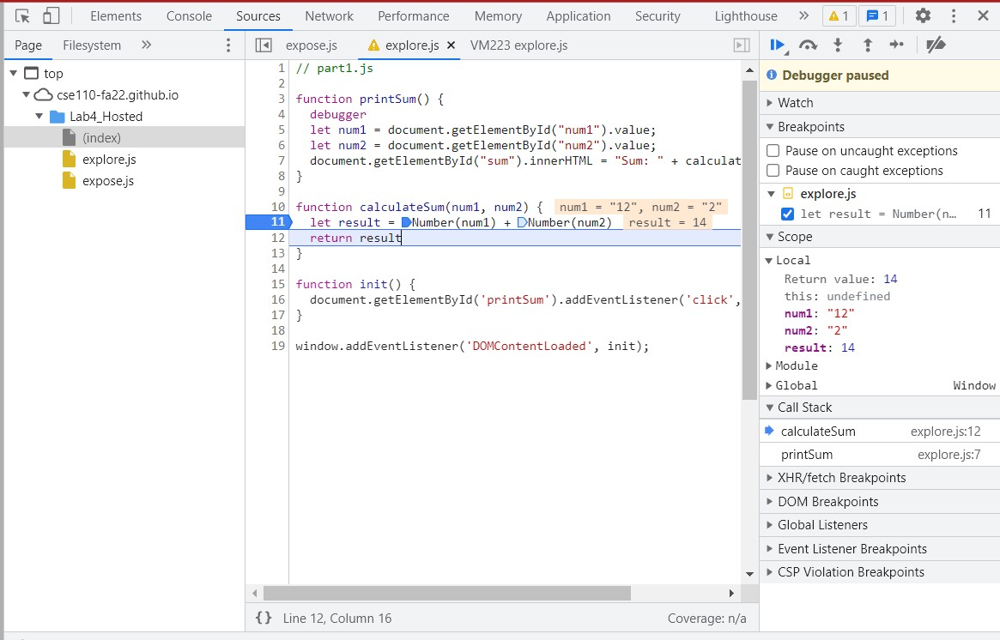

# Answers to Debugging section of Explore

First Screenshot: 

Second Screenshot: 

1. The bug is that when num1 and num2 are getting retrieved from the user input, they are getting saved as strings rather than integers, so when we add them together, javascript thinks we are appending 2 strings, thus result has the dataType "string" and we append num1 and num2 rather than adding them together. 
2. To fix this, I simply cast num1 and num2 to numbers (using Numbers()) to ensure that the script adds them as integers. 
 